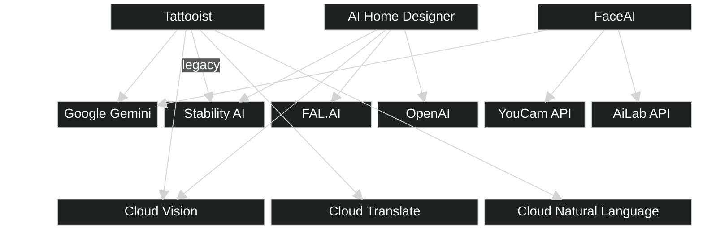
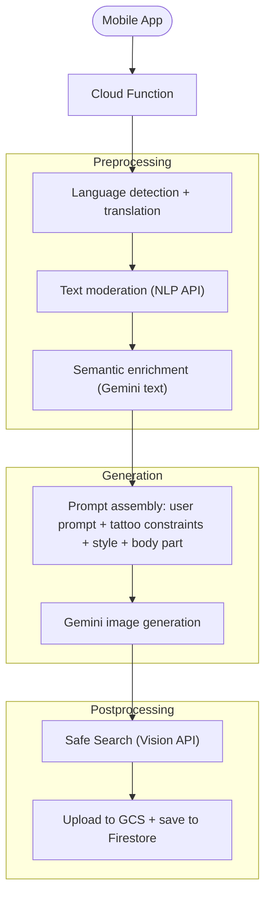
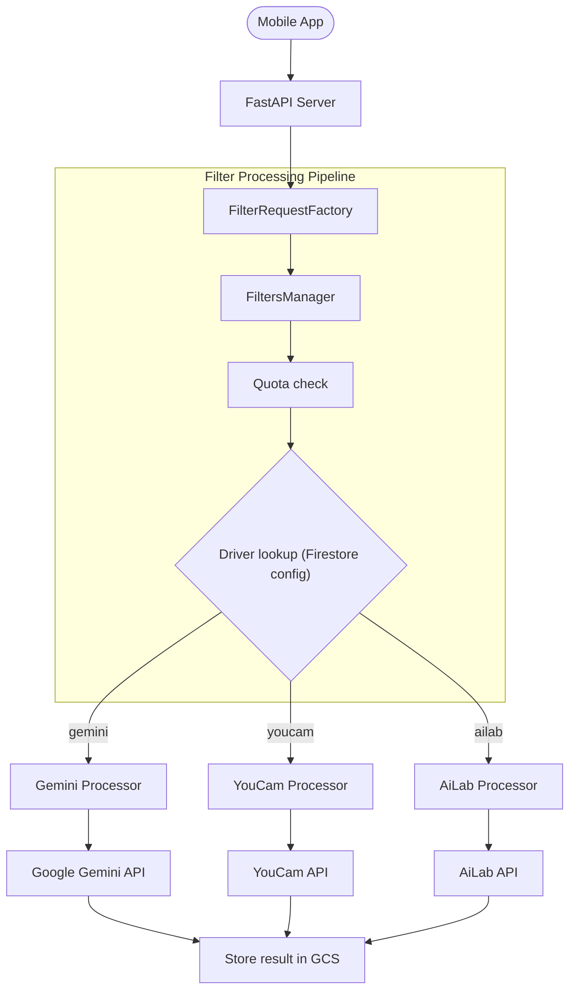

```mermaid
flowchart TD
    Client([Mobile App]) --> Bridge["AI Bridge Backend (Node.js)"]

    subgraph bridge [API Gateway]
        Auth["Auth + rate limiting"]
        Val["Request validation (Joi)"]
        Format["Format for AI service"]
    end

    Bridge --> Auth --> Val --> Format

    Format --> AISvc["AI Service (Python/Flask)"]

    subgraph aisvc [AI Service]
        ContentSafety["Content safety (GPT-4o mini + Vision)"]
        PromptOpt["Prompt optimisation (GPT-4o mini)"]
        Dispatch{"Feature router"}
    end

    AISvc --> ContentSafety --> PromptOpt --> Dispatch

    Dispatch -->|interior design| FalNano["FAL.AI Nano Banana"]
    Dispatch -->|object replacement| FalFlux["FAL.AI FLUX.1 Fill"]
    Dispatch -->|style transfer| FalOrStab["FAL.AI or Stability"]
    Dispatch -->|paint| FalOrStab2["FAL.AI or Stability"]
```

# Apps - AI Usage [Tattooist, FaceAI, AI Design]

---

## Overview

We consume AI across three consumer apps: **Tattooist**, **AI Home Designer**, and **FaceAI**. Each app has its own backend that calls one or more AI providers. This document maps out what we use, how we use it, and the common patterns across all three.




---

## 1. Tattooist

**Stack:** Node.js (Google Cloud Functions) + Firestore

**What it does:** Generates tattoo designs from text or reference images, applies styles, and composites tattoos onto body parts.

### Features


| Feature             | Description                                                      |
| ------------------- | ---------------------------------------------------------------- |
| Text-to-image       | Generate tattoo designs from a text prompt                       |
| Image-to-image      | Transform a reference photo into a tattoo style                  |
| Style transfer      | Apply a style preset (e.g. traditional, watercolour) to a prompt |
| Tattoo on body      | Composite a generated tattoo onto a body-part photo              |
| Semantic enrichment | LLM expands a short user prompt into a richer description        |
| Keyword extraction  | LLM extracts keywords from tattoo images for search/discovery    |


### Models


| Provider      | Model                           | Purpose                                                               |
| ------------- | ------------------------------- | --------------------------------------------------------------------- |
| Google Gemini | `gemini-2.5-flash-image`        | Primary image generation (text-to-image, image-to-image, composition) |
| Google Gemini | `gemini-2.5-flash`              | Text generation (semantic enrichment, keyword extraction)             |
| Stability AI  | `stable-diffusion-xl-1024-v1-0` | Legacy image generation (being phased out)                            |


### Architecture




### Prompt Engineering

The final prompt sent to Gemini is assembled from four config-driven pieces, all stored in Firestore with versioning:


| Component                 | Firestore source                                      | What it contains                                                                           |
| ------------------------- | ----------------------------------------------------- | ------------------------------------------------------------------------------------------ |
| User prompt               | Request body                                          | The raw user input (translated to English if needed)                                       |
| Generic tattoo constraint | `config_genericTattooConstraint`                      | Global instructions that apply to every generation (e.g. "generate a clean tattoo design") |
| Style guidelines          | `styles` collection (`complementary_prompt` field)    | Per-style rules (e.g. traditional, watercolour, Japanese)                                  |
| Body part placement       | `bodyparts` collection (`complementary_prompt` field) | Where and how to place the tattoo on the body                                              |


These are injected into a template via placeholders:

```
${originalPrompt}
${genericTattooConstraint}
Style guidelines: ${styleGuidelines}
Body part placement: ${bodyPartPlacement}
```

**Semantic enrichment** is an optional LLM preprocessing step. When enabled, Gemini text (`gemini-2.5-flash`) rewrites the user's short prompt into a richer scene description using a versioned system prompt from `config_semanticEnrichmentSystemPrompt`. The system prompt uses `${userPrompt}` and `${styleDescription}` (from `llm_style_rules` in Firestore) as placeholders. When enrichment succeeds, the enriched prompt replaces the original and style guidelines are no longer injected separately (they are baked in).

**Image-to-image vs text-to-image:** same prompt template, but the input image is prepended to the content array and aspect ratio is auto-derived from its dimensions.

**Additional safety prompts** (avoiding watermarks, unwanted body-part placements) are appended from Remote Config as static text blocks.

**Keyword extraction** uses a separate Firestore system prompt (`config_discoverKeywordExtractionSystemPrompt`) with `${languageProcessed}` and `${llmEnriched}` placeholders to extract search keywords from tattoo descriptions.

### Authentication


| Layer                | Mechanism                                                                                          |
| -------------------- | -------------------------------------------------------------------------------------------------- |
| **Client auth**      | JWT (HS256) in `Authorization: Bearer <token>` header (v2) or `token` header (v1 legacy)           |
| **Token validation** | JWT signature check with `SECRET_KEY`, then token lookup in Firestore `tokens` collection          |
| **API Gateway**      | GCP API Gateway forwards the client's `Authorization` header as `x-forwarded-authorization`        |
| **AI provider keys** | Stored in Google Cloud Secret Manager; loaded at startup via `getSecrets()`                        |
| **Rate limiting**    | No application-level rate limiting; relies on Gemini's built-in limits with retry + backoff on 429 |


All routes require auth except internal endpoints (protected by a separate `x-internal-secret` header).

---

## 2. AI Home Designer

**Stack:** Node.js/Express (API gateway) + Python/Flask (AI service)

**What it does:** Transforms room photos -- redesigns interiors, replaces objects, transfers styles, and paints over masked regions.

### Features


| Feature            | Description                                   |
| ------------------ | --------------------------------------------- |
| Interior design    | Redesign a room photo in a chosen style       |
| Object replacement | Replace a masked object with something new    |
| Style transfer     | Apply a design style to an existing room      |
| Paint              | Inpaint a masked area with a described change |


### Models


| Provider     | Model                                   | Purpose                                                |
| ------------ | --------------------------------------- | ------------------------------------------------------ |
| FAL.AI       | Nano Banana (`fal-ai/nano-banana/edit`) | Interior design, style transfer, paint                 |
| FAL.AI       | FLUX.1 Fill (`fal-ai/flux-pro/v1/fill`) | Object replacement                                     |
| Stability AI | SD v2beta                               | Style transfer and inpainting (fallback)               |
| OpenAI       | GPT-4o mini                             | Prompt optimisation, content moderation, colour naming |


### Architecture




### Prompt Engineering

This app uses a **two-stage prompt pipeline**: GPT-4o mini first rewrites the user prompt, then the optimised prompt is sent to the image generation provider (FAL.AI or Stability).

**Stage 1 -- GPT-4o mini prompt optimisation.** The user prompt is sent to GPT-4o mini with a system prompt that instructs it to condense and optimise for FAL.AI Nano Banana, with heavy emphasis on architectural preservation. Key rules baked into the system prompt:

- Preserve 100% of original room structure (walls, windows, doors, openings)
- Only furniture, decor, and lighting may be modified
- Condense to max 7 lines of natural language
- If the input is inappropriate, return `[EXPLICIT]` (used as a content moderation signal)

GPT-4o mini is called with `temperature=0.0` and `max_tokens=300`.

**Stage 2 -- Provider-specific prompt assembly.** The optimised prompt is then enriched with domain context:


| Enhancement                        | How it works                                                                                                                                                                                           |
| ---------------------------------- | ------------------------------------------------------------------------------------------------------------------------------------------------------------------------------------------------------ |
| Room-specific config               | `ROOM_CONFIGURATIONS` dict maps room types (kitchen, living room, bedroom, etc.) to specific furniture, appliances, decor, environment, and lighting descriptions. These are injected into the prompt. |
| Architectural preservation phrases | A long instruction block ("CRITICAL ABSOLUTE REQUIREMENT") forbids all structural changes, plus a list of architectural negative terms (e.g. "new windows", "altered walls", "structural changes").    |
| Negative prompts                   | Each feature has its own set. Paint has 120+ negative terms. Object replacement uses GPT-4o mini to generate dynamic negative prompts per request. Style transfer has ~40 universal terms.             |


**Content moderation** uses three layers: GPT-4o mini (returns `[EXPLICIT]`), OpenAI Moderation API (`moderations.create`), and local pattern matching in strict mode.

### Authentication


| Layer                    | Mechanism                                                                                                               |
| ------------------------ | ----------------------------------------------------------------------------------------------------------------------- |
| **Client auth**          | Firebase ID token in `Authorization: Bearer <token>` header, verified via `admin.auth().verifyIdToken()`                |
| **Version gating**       | `x-app-version` and `x-platform` headers checked against minimum version (semver)                                       |
| **Rate limiting**        | Device-based: 100 requests per 15-minute window, keyed by `{platform}_{appVersion}_{tokenSignature}` (falls back to IP) |
| **AI provider keys**     | Environment variables (`OPENAI_API_KEY`, `STABILITY_API_KEY`, `FAL_API_KEY`)                                            |
| **Bridge to AI Service** | No auth -- the Python AI service is network-isolated (private VPC); access control is infrastructure-level              |


Middleware chain: `headerValidation` -> `authMiddleware` (Firebase) -> `deviceRateLimiter` -> `validation` (Joi) -> controller.

---

## 3. FaceAI

**Stack:** Python/FastAPI + Firestore

**What it does:** Applies AI-powered face and portrait transformations -- aging, gender swap, hairstyles, makeup, skin enhancement, and more.

### Features


| Feature                                                         | Provider |
| --------------------------------------------------------------- | -------- |
| Gender swap, impressions, glasses, beard, features              | Gemini   |
| Age transformation, hair (style, colour, length, volume, bangs) | YouCam   |
| Makeup (blush, eyeliner, bronzer, contour, etc.)                | YouCam   |
| Background removal                                              | YouCam   |
| Foundation, lip colour, skin enhancement, smile                 | AiLab    |
| Face/content analysis (structured JSON)                         | Gemini   |


### Models


| Provider      | Model                    | Purpose                                                     |
| ------------- | ------------------------ | ----------------------------------------------------------- |
| Google Gemini | `gemini-2.5-flash-image` | Image generation (gender swap, impressions, glasses, beard) |
| Google Gemini | `gemini-2.0-flash`       | Structured image analysis (face count, content check)       |
| YouCam API    | Proprietary              | Face/hair effects, aging, makeup                            |
| AiLab API     | Proprietary              | Portrait effects (skin, lips, size, smile)                  |


### Architecture




### Prompt Engineering

Every Gemini-based filter has a **per-variant prompt dictionary** with descriptive, self-contained instructions. Each variant (e.g. `gender_male`, `impression_studioGlow`, `smile_wide`) maps to a dedicated prompt string. Examples:


| Filter      | Variants                                                                   | Prompt pattern                                                                                                                      |
| ----------- | -------------------------------------------------------------------------- | ----------------------------------------------------------------------------------------------------------------------------------- |
| Gender swap | `gender_male`, `gender_female`, `gender_feminine`, `gender_masculine`      | "Transform the person from female to male while keeping facial features recognizable. Maintain same pose, lighting, background..."  |
| Impressions | 14 styles (studio glow, glamour, red carpet, cinema, golden hour, etc.)    | "Create a professional studio look with soft, even lighting, and radiant skin glow. Do not tilt, rotate, or reposition the head..." |
| Smile       | `natural`, `wide`, `closed`, `tight`, `seductive`, `angry`, `confused`     | "Give the person a natural, relaxed smile that looks genuine. Keep all other facial features exactly the same."                     |
| Glasses     | Single prompt (two-image input: reference glasses + subject)               | "Add the glasses from the glasses image over the person's eyes, making the result look realistic and well-fitted..."                |
| Beard       | `full_beard` (and others via Firestore)                                    | "Add a full, natural-looking beard... blend seamlessly with facial features. Keep all other features unchanged."                    |
| Features    | `dimples`, `cheekbones`, `sharpChin`, `cupidBow`, `doubleChin`, `hairLine` | Per-feature instructions to add, enhance, or remove specific facial features                                                        |
| Size        | `smallNose`, `bigFace`, `bigEyes`, `bigLips`, `thinEyebrows`, etc.         | "Apply size change: very big eyes effect, soft increase, maintain realistic lighting and eye detail."                               |


**Firestore prompt override.** Every prompt can be overridden at runtime without redeployment. The `BackendFilters` Firestore collection stores per-filter, per-driver configuration:

```json
{
  "current_driver": "gemini",
  "drivers": {
    "gemini": {
      "prompts": {
        "gender_male": "Custom prompt...",
        "gender_female": "Custom prompt..."
      }
    }
  }
}
```

The config provider loads Firestore first; code-level defaults are used only as fallback. The `current_driver` field controls which AI provider is active for each filter, enabling live A/B testing or migration between providers.

**Image analysis** uses Gemini text (`gemini-2.0-flash`) with structured output. A fixed prompt asks the model to return JSON matching a Pydantic schema (`face_count`, `content_appropriate`, `gender_detection`), using `response_mime_type="application/json"`.

### Authentication


| Layer                | Mechanism                                                                                                        |
| -------------------- | ---------------------------------------------------------------------------------------------------------------- |
| **Client auth**      | Firebase App Check (`X-AppCheck` header) required at login; JWT (HS256) Bearer token for all subsequent requests |
| **Login flow**       | `POST /auth/v1/login` -> Firebase App Check validation -> external quota service issues JWT                      |
| **Token validation** | JWT decoded with shared secret; payload contains `user_id` (RevenueCat anonymous ID)                             |
| **Quota management** | External quota service handles usage limits and token balances; checked before every AI call                     |
| **AI provider keys** | Environment variables (`GEMINI_API_KEY`, `AI_LAB_TOOLS_API_KEY`); YouCam uses config-based auth                  |
| **Rate limiting**    | No per-request rate limiting in the API; quota is enforced by the external quota service                         |


Auth is enforced via FastAPI dependency injection (`Depends(current_user)`) rather than middleware. All filter and analysis endpoints require a valid JWT.

---

## Cross-Cutting Patterns

These patterns are consistent across all three backends:


| Pattern                       | Description                                                                                                                                                             |
| ----------------------------- | ----------------------------------------------------------------------------------------------------------------------------------------------------------------------- |
| **Content safety**            | Every app validates inputs before sending to AI. Tattooist uses Cloud NLP + Vision. AI Home Designer uses GPT-4o mini + Vision. FaceAI uses Gemini structured analysis. |
| **Config-driven prompts**     | Prompts are not hardcoded. All three apps store prompt templates in Firestore, enabling iteration without redeployment.                                                 |
| **Prompt enrichment**         | User input is short and informal. Each app enriches it before sending to the model -- Tattooist uses Gemini text, AI Home Designer uses GPT-4o mini.                    |
| **Provider abstraction**      | FaceAI and AI Home Designer support multiple providers per feature with runtime switching. Tattooist has migrated from Stability to Gemini, retaining the legacy path.  |
| **Retry with backoff**        | All three apps implement retry logic for rate limits (429) and transient failures.                                                                                      |
| **No async queues**           | None of the apps use dedicated job queues. AI calls are synchronous within the request lifecycle, with in-process concurrency (Promise.all / asyncio).                  |
| **Image pre/post processing** | Input images are resized, validated, and format-converted before the AI call. Output images go through safety checks before being returned.                             |


---

## Provider Summary


| Provider               | App                                  | Models                                                           | Use Case                                                               |
| ---------------------- | ------------------------------------ | ---------------------------------------------------------------- | ---------------------------------------------------------------------- |
| Google Gemini          | Tattooist, FaceAI                    | `gemini-2.5-flash-image`, `gemini-2.5-flash`, `gemini-2.0-flash` | Image generation, image-to-image, text enrichment, structured analysis |
| Stability AI           | Tattooist (legacy), AI Home Designer | SDXL 1.0, SD v2beta                                              | Image generation, style transfer, inpainting                           |
| FAL.AI                 | AI Home Designer                     | Nano Banana, FLUX.1 Fill                                         | Interior design, object replacement, style transfer                    |
| OpenAI                 | AI Home Designer                     | GPT-4o mini                                                      | Prompt optimisation, content moderation                                |
| YouCam                 | FaceAI                               | Proprietary                                                      | Face/hair effects, aging, makeup, background removal                   |
| AiLab                  | FaceAI                               | Proprietary                                                      | Portrait effects (skin, lips, size, smile)                             |
| Google Cloud Vision    | Tattooist, AI Home Designer          | Safe Search                                                      | NSFW image detection                                                   |
| Google Cloud NLP       | Tattooist                            | Natural Language                                                 | Text moderation                                                        |
| Google Cloud Translate | Tattooist                            | Translation                                                      | Non-English prompt translation                                         |


