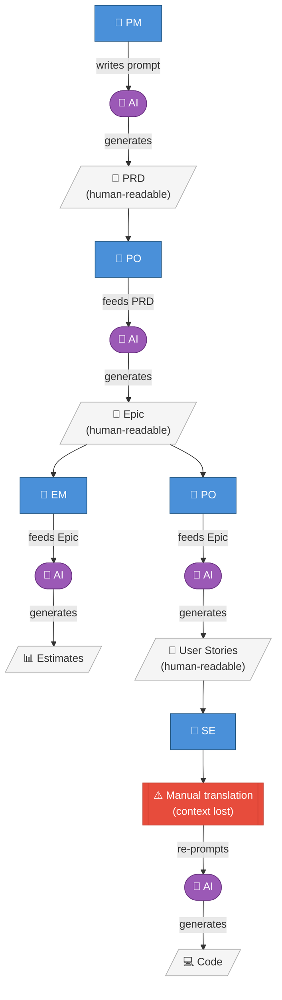
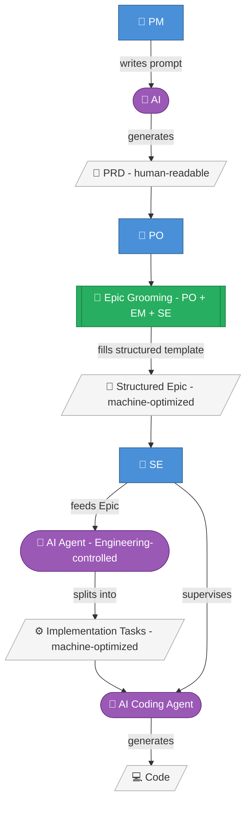

# Epic Framework

## What this is

A structured approach to closing the gap between Product and Engineering in an AI-assisted development workflow.

This folder contains a template, worked examples, and workflow diagrams. It is designed to be self-contained so it can be shared with Product leads or moved into a dedicated project.

---

## The Problem

Our current workflow looks like this:

```
PM → [AI] → PRD → PO → [AI] → Epic → EM → [AI] → Estimates → PO → [AI] → User Stories → SE → [AI] → Code
```

Every artifact in this chain — PRD, Epic, User Story — is generated by AI and formatted for human consumption. But each one is then fed straight back into another AI at the next step. This creates three compounding problems:

1. **Context is lost at every handoff.** Each AI re-generation compresses and sometimes distorts the intent of the step before it.
2. **User Stories are expensive and low-value.** They take significant PO time to write, are often thin on detail, and by the time they reach a Software Engineer they are missing the information actually needed to implement the feature.
3. **The SE has to translate.** A User Story is written for a human to read. An SE using an AI coding agent must re-interpret it into something the agent can act on — an invisible step that costs time and produces inconsistent results.

---

## The Experiment

Remove User Stories from the chain. Have Software Engineers work directly from a structured Epic.

The new workflow:

```
PM → [AI] → PRD → PO + EM + SE grooming → Structured Epic → SE → [AI Agent] → Implementation Tasks → [AI Coding Agent] → Code
```

Key changes:

- **The Epic is the handoff unit.** It replaces the User Story as the artifact Engineering works from.
- **The Epic template is strict.** It forces Product to provide everything Engineering needs upfront — user flows, UI states, acceptance criteria, analytics events — rather than leaving gaps that become back-and-forth during development.
- **Engineering controls task decomposition.** The SE uses an AI agent to split the Epic into implementation tasks. This keeps the decomposition in the hands of the people who understand the codebase, and makes the tasks machine-optimized rather than human-readable.
- **Grooming moves up a level.** Instead of grooming User Stories one by one, the team grooms the Epic together. Engineering fills in architecture decisions in the Technical Context section, and the EM sets effort and target sprint in the Delivery Plan.
- **Slicing stays explicit without Stories.** The Epic includes a Delivery Plan (milestones) so the team can ship iteratively without the overhead of writing User Stories.

This is a pilot. It will run on one Epic in one app (FaceAI) before being rolled out more broadly.

---

## The Template

**File:** `epic-template.md`

The template is the contract between Product and Engineering. Every section must be completed before an Epic is considered ready for Engineering to pick up.

### Who fills in what

| Section | Owner |
|---|---|
| TL;DR | PM / PO |
| Epic Type | PM / PO (confirmed in grooming) |
| Business Goal | PM / PO |
| Problem Statement | PM / PO |
| Scope (In Scope / Out of Scope) | PM / PO |
| Delivery Plan — slices, exit criteria, flagging | PM / PO |
| Delivery Plan — total estimate | **EM** (filled during or after grooming) |
| User Flows | PM / PO |
| Acceptance Criteria | PM / PO |
| Non-functional Requirements (NFRs) | Engineering (during grooming; QA consulted) |
| UI States | PM / PO |
| Analytics Events | PM / PO |
| Technical Context — product-level context | PM / PO |
| Technical Context — architecture decisions | PM / PO + Engineering (grooming) |
| Design References | PM / PO — **hard gate for UI Feature epics** |
| Open Questions | PM / PO — must be empty before Ready for Engineering |
| Dependencies & Prerequisites | PM / PO + Engineering |
| Assumptions | PM / PO + Engineering |
| Risks | PM / PO + Engineering |

### Status lifecycle

An Epic moves through these statuses before Engineering starts work:

```
Draft → Ready for Grooming → Ready for Engineering → In Progress → Done
```

- **Draft** — template is being filled in by Product. Not ready for Engineering to review.
- **Ready for Grooming** — Product has completed their sections. Engineering reviews, fills in architecture decisions in Technical Context and NFRs, and EM adds the total estimate below the Delivery Plan.
- **Ready for Engineering** — all sections complete, estimate confirmed, and design requirements met (Figma attached for UI Feature epics, or explicitly “Not required” for non-UI epics). SE can pick this up.

An Epic must reach **Ready for Engineering** before any development work begins. If Engineering starts before the template is complete, the template has failed its purpose.

### The hard gates

These sections block an Epic from advancing regardless of everything else:

- **Figma not attached (UI Feature epics)** → Epic stays in Draft
- **User Flows missing (or system flows for non-UI epics)** → Epic stays in Draft
- **Acceptance Criteria not testable** → Epic stays in Draft (rewrite until QA can verify without asking anyone)
- **Out of Scope not filled** → Epic stays in Draft
- **Open Questions not resolved** → Epic stays in Draft (or move the epic to Spike/Discovery type)
- **Non-functional Requirements missing when relevant** → Epic stays in Draft (at minimum: write “N/A” explicitly per category)

---

## Reading the examples

Three worked examples are included. Read them in this order:

### 1. `epic-AIDesign-ads-template-example.md` — Ads Before Creation (ADIOSMAU-1317)

A well-structured example from AI Design. Use this to show **what good looks like** when Product has done their job. Note the `⚠️` markers — these are the gaps that existed in the original Jira epic and had to be added during the exercise. They illustrate exactly what the template is designed to surface before Engineering picks up the work.

### 2. `epic-faceai-remove-objects-example.md` — Remove Objects (FAIOSMAU-366)

A thinner source epic from FaceAI. Use this to show **what happens when key sections are missing** — the AI/ML vendor is not decided, Figma is absent, and the monetisation model is undefined. Under the old workflow these gaps would have been discovered mid-sprint. With the template they are visible before a single line of code is written.

### 3. `epic-faceai-retouch-enhancements-example.md` — Retouch Tool Enhancements (FAIOSMAU-255)

The pilot epic — the one this experiment will run on first. Use this as the **live test case** when walking the SE and PO through the new workflow. It has no external dependencies, no vendor decisions open, and no Figma required (pure algorithm + performance work), which makes it a clean first run.

---

## The workflow diagrams

Use these when presenting this initiative to stakeholders. The before diagram makes the problem visible; the after diagram shows that we are not removing AI from the process — we are removing the lossy human-to-human handoffs in the middle.

### Before



### After



---

## What this does not solve

- **Template discipline.** The template only works if Product fills it in before Engineering picks up the work. Enforcement is a team behaviour, not a tool problem.
- **Grooming quality.** Moving grooming to the Epic level is only better than Story grooming if the Epic is complete when the team sits down. An incomplete Epic in grooming is worse than the old workflow.
- **The PRD → Epic step.** The PM still uses AI to generate the Epic from the PRD. That step has the same lossy-compression problem as before. Fixing it is out of scope for this pilot.
