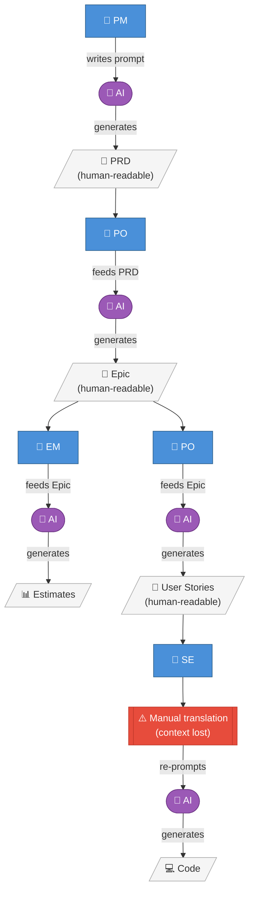
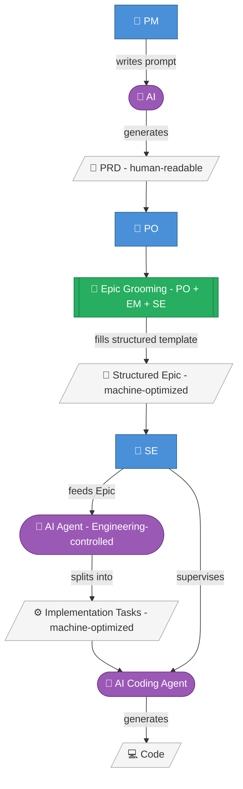

# Epic Workflow — Before & After

## Before


```mermaid
flowchart TD
    classDef human fill:#4A90D9,stroke:#2C5F8A,color:#fff
    classDef ai fill:#9B59B6,stroke:#6C3483,color:#fff
    classDef artifact fill:#F5F5F5,stroke:#AAAAAA,color:#333
    classDef pain fill:#E74C3C,stroke:#C0392B,color:#fff

    PM[👤 PM]:::human
    AI1([🤖 AI]):::ai
    PRD[/"📄 PRD\n(human-readable)"/]:::artifact

    PO1[👤 PO]:::human
    AI2([🤖 AI]):::ai
    EPIC[/"📄 Epic\n(human-readable)"/]:::artifact

    EM[👤 EM]:::human
    AI3([🤖 AI]):::ai
    EST[/"📊 Estimates"/]:::artifact

    PO2[👤 PO]:::human
    AI4([🤖 AI]):::ai
    US[/"📄 User Stories\n(human-readable)"/]:::artifact

    SE[👤 SE]:::human
    TRANS[["⚠️ Manual translation\n(context lost)"]]:::pain
    AI5([🤖 AI]):::ai
    CODE[/"💻 Code"/]:::artifact

    PM -->|writes prompt| AI1
    AI1 -->|generates| PRD
    PRD --> PO1
    PO1 -->|feeds PRD| AI2
    AI2 -->|generates| EPIC
    EPIC --> EM
    EM -->|feeds Epic| AI3
    AI3 -->|generates| EST
    EPIC --> PO2
    PO2 -->|feeds Epic| AI4
    AI4 -->|generates| US
    US --> SE
    SE --> TRANS
    TRANS -->|re-prompts| AI5
    AI5 -->|generates| CODE
```


---

## After


```mermaid
flowchart TD
    classDef human fill:#4A90D9,stroke:#2C5F8A,color:#fff
    classDef ai fill:#9B59B6,stroke:#6C3483,color:#fff
    classDef artifact fill:#F5F5F5,stroke:#AAAAAA,color:#333
    classDef collab fill:#27AE60,stroke:#1A7A43,color:#fff

    PM["👤 PM"]:::human
    AI1(["🤖 AI"]):::ai
    PRD[/"📄 PRD - human-readable"/]:::artifact

    PO["👤 PO"]:::human
    GROOM[["🤝 Epic Grooming - PO + EM + SE"]]:::collab
    EPIC[/"📄 Structured Epic - machine-optimized"/]:::artifact

    SE["👤 SE"]:::human
    AI2(["🤖 AI Agent - Engineering-controlled"]):::ai
    TASKS[/"⚙️ Implementation Tasks - machine-optimized"/]:::artifact

    AI3(["🤖 AI Coding Agent"]):::ai
    CODE[/"💻 Code"/]:::artifact

    PM -->|writes prompt| AI1
    AI1 -->|generates| PRD
    PRD --> PO
    PO --> GROOM
    GROOM -->|fills structured template| EPIC
    EPIC --> SE
    SE -->|feeds Epic| AI2
    AI2 -->|splits into| TASKS
    TASKS --> AI3
    SE -->|supervises| AI3
    AI3 -->|generates| CODE
```


```

```

