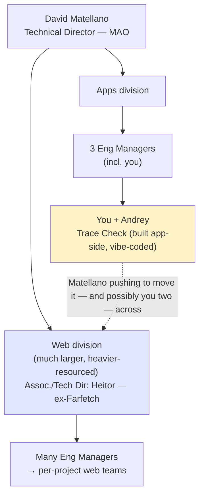

# Meeting Analysis — Andrey, 20 July 2026

*Scored against the **2026-07-20 prep doc** (all four planned topics were covered). Note: the 13 July 1:1 happened but was not recorded, so this is the first analysis in two weeks — some carry-overs had already moved. Structure of the meeting: ~15% personal (Italy heat, holidays), then a long, genuinely two-way strategy block (web-vs-apps + org move + AI-architecture philosophy + safeguards), then Trace Check status, tokens, iMote, and a direct career question near the end. Talk ratio was the best in months.*

---

## Coverage Check (vs. 20 July prep doc)

| Topic | Status | Notes |
|---|---|---|
| **Wrap Trace Check — funnel + payments** | ✅ Covered | Payments infra ready (prod Stripe set Friday); but both loops **deliberately parked** pending product spec. "Slightly stuck." |
| **Web vs Apps preference** | ✅ Covered | Andrey answered plainly: **prefers apps** ("that's what I know"), but **not opposed** to web. Bigger org dimension emerged (below). |
| **iMote — POC + unblock** | ✅ Covered | The "discovery POC" is now clear: a **Trakt "movie of the night" POC**, baked into the app, handed to Fernando. Android Martech SDK = the real priority; TVFK at risk of slipping to Sept. |
| **Career — Staff vs Manager** | ✅ Covered | Asked directly. **Surprise:** first instinct was **Engineering Manager**, then reasoned toward Staff. Genuinely ambivalent — not the clean "Staff" you expected. |
| Recognition at minute 0 (self-watch) | 🟡 Partial | Strong *quantified/comparative* praise ("5× more code than #2 in the company"), but landed **late** and framed as output-volume, not a named artifact up front. |
| Invoke the capacity contract (self-watch) | 🔴 Missed | Only an informal *"raise your hand when you run out of tokens."* The structured contract / named help-triggers were not referenced — right as the solo window opens. |

---

## The headline development: Trace Check is moving to MAO's Web division

This wasn't on the prep doc and it reframes the whole web-vs-apps question. Matellano is pushing for **you and Andrey to be "part of this"** as Trace Check transitions to the web side. Your stated fear, in your own words: *"if we say Filippo [and] Andrei are going to work on Trace Check web, they are going to simply move us there — and the app part of it is going to be less and less."*

Andrey's apps preference is now a **direct input into how hard you resist that pull.** He'll go where needed, but he told you clearly he'd rather stay in apps "because I know what's going on there." That gives you a clean rationale in the Heitor conversation: hand the *codebase* to web, keep *the people* anchored in apps.

---

## Key Outcomes

- **Web-vs-apps fork resolved (for now):** Andrey prefers apps, is willing to help on web if needed. You confirmed *"that's what I thought"* — so the Vlad-swap scenario stays dormant; no reassignment triggered. The live question is now organisational (does Trace Check's move drag you both into the web division), not personal preference.
- **Trace Check deliberately parked on two points:** payments/offering config and the funnel/account-creation flow. You told Andrey **not to touch either** until product writes and finalises the user stories. You asked product to draft user stories this morning and will push Jose Antonio (owns the "stories ready" signal) + read every story until the spec is nailed. Everything else (reports, buy-more-credits) is essentially done bar UI fixes.
- **You're taking a web staff engineer to review the codebase** — via Heitor, in the 11:00 meeting. Scope you defined: **security** and **observability** (web crash/error monitoring — the mobile-Crashlytics equivalent you don't have), asked as *specific questions*, not "here's our code, judge it."
- **Career read updated:** Andrey is not a clean "Staff." Gut-first answer was EM ("that's something interesting to me"); on reflection he leaned Staff because the advisor→AI-SE path feels closer to it. You noted he's unusually strong with stakeholders/product-pushing for his level — an EM-leaning signal worth not dismissing.
- **Token-cliff warning issued (important):** the current pace burned **~1.5–2 months of tokens in one week**, sustained only by vendors' emergency resets/promotions (Codex resetting daily→every-other-day; Fable kept in-subscription). When that stops, **throughput drops hard.** Andrey asked you to set that expectation upward. You agreed to be vocal with Matellano + product and to backfill when he runs dry.
- **iMote is "pretty dead" operationally:** product disconnect (Herman out; Fernando joined one standup). The Trakt POC is done and with Fernando. **Android Martech SDK is the one real priority** — and it's product-blocked, not on Andrey. You'll take it to Fernando.

---

## Action Items

| Action | Owner | Deadline | Notes |
|---|---|---|---|
| Meet **Heitor** — negotiate Trace Check→web move; request a web **staff engineer** to review **security + observability** | You | Today, 11:00 | Frame as specific questions; protect the "keep the people in apps" line |
| Push product to write + finalise **user stories** for payments/offering + funnel | You | This week (ongoing) | Chase **Jose Antonio** for the "stories ready" confirmation (1 wk overdue) |
| **Park** payments/offering + funnel/account-creation implementation until spec is final | Andrey | Until spec lands | Small non-payment/funnel feedback items OK if tokens spare |
| Continue reconciling Jira backlog stories ↔ implementation (weekend PRs) | Andrey | Ongoing | Watch AI over-engineering / side-quests; get tickets "ready for testing" for Maria (QA) |
| Talk to **Fernando** to unblock **iMote Android Martech SDK** release | You | This week | The only real iMote priority; iOS already out |
| Get **Alexi's** time to test **TV Foundation Kit** this week | Andrey | This week | Else it slips to **September**; Alexi sick today, ~4 days before his 3-wk vacation |
| Be vocal upward about the **token cliff** — pace isn't repeatable once resets stop | You | This week | To Matellano + product |
| Try **new model ("Soul" — transcription-uncertain)** now that Q-code trial ($120) is resolved | Andrey | This week | Reportedly strong on front-end/Figma match; very token-hungry |
| Send a quick AM update Tuesday if arriving late to the Trace Check catch-up | Andrey | Tomorrow | Standing since you flagged the slight stuck-ness |

---

## Your Communication — Honest Assessment

**Talk ratio: your best meeting in months.** The long strategy block was genuinely co-owned — you explicitly opened the floor (*"How do you feel about it?"*, *"I'm brainstorming with you here"*, *"what do you think?"*) and Andrey ran with substantial input: the whole AI-architecture philosophy, the safeguards realism, the token economics, the model comparisons. The old monologue-in-strategy-blocks failure mode did **not** repeat. The one long monologue (the MAO org structure / Heitor) was appropriate — you were transferring context Andrey lacked. Keep this shape; it's what you've been aiming at.

**Recognition: better, but still not the rep.** *"I doubt there's someone more proficient than you in the company… you're producing five times more code than the second-placed person"* is real, specific-ish, and comparative — a step up from "you're a star." But it (a) landed **late**, in the tokens block, not at minute 0, and (b) framed him as a **volume** outlier rather than naming a **senior-judgment artifact**. The durable habit — *name the specific senior-engineering call, in the first breath* — is still unbuilt after many meetings. You had two perfect artifacts to name up front (the 20-hour Figma-matched front-end via the new model; the Trakt POC he shipped solo) and used neither.

**The career question was well-handled — and you stayed curious instead of steering.** You asked cleanly, and when his answer surprised you (*"Really?"*) you didn't argue him back to your prior. You let him reason to Staff himself and reflected the stakeholder-strength signal back honestly. Good restraint. Only gap: you framed it entirely in the *old* model ("previous model, very important disclaimer") — which is fine as a thought experiment, but you left the *new* blurred path undefined for him. He said twice he doesn't know the requirements for either; that's an opening to actually shape, when the company's new ladder lands.

**You shielded well again — and were honest about your own role.** *"I've just chipped in mainly… to save you from weird conversations with people. Manager's job."* Naming that you're absorbing the product/Martech noise on his behalf is exactly the protection his profile needs. And you were straight about being "vibe coders" together, which keeps the relationship peer-ish and safe.

**One thing you let pass: the hours signal.** Andrey mentioned 20-hour model runs and "23 hours of working a day," half-joking about the clock-in system. You empathised (*"I feel you"*) and moved on. Going into a solo-coverage + token-crunch week, that's the exact moment the **capacity contract** exists for — and you reached for an informal "raise your hand" instead of the structured mechanism. Worth a real check next time.

---

## Patterns vs. Previous Meetings

- **Talk ratio: genuinely fixed this meeting.** The two-way/one-way split that tracked "who holds the material" didn't bite — even on strategy you held the floor *with* him, not *at* him. Best instance in the record.
- **Recognition: still the one unbuilt habit.** Trajectory over months: reflexive "nice" → warm-generic → specific-but-late (29 Jun) → generic (6 Jul) → quantified-but-late (20 Jul). Placement and artifact-naming remain the gap; warmth and even specifics are there.
- **Completed-but-unshipped: persists, but clearly not his fault now.** TVFK (built, untested, Sept risk) and Android Martech SDK (done-ish, product-blocked) are both aging — but the blocker has shifted decisively to **product/testing capacity**, not Andrey sitting on merged work. The PR-visibility loop you set up is doing its job.
- **Capacity contract: still not being invoked** — third meeting where the structured mechanism you built goes unused in favour of ad-hoc offers, right as the six-week solo window (Alexi off next week) begins.
- **Product decision-latency is *the* recurring blocker** across both projects — Trace Check (funnel/payments spec) and iMote (Fernando disconnect). You're managing it by shielding + pushing upward, consistent with prior meetings. It remains Andrey's core stressor, and you're handling it the right way.
- **Compute-constraint theme continues:** from "5% tokens left" (6 Jul) to a company-wide dependence on vendor resets, plus his own $120 trial top-up. He's self-financing headroom and now explicitly warning the pace is borrowed time.

---

## Flags for Next Meeting

1. **Heitor / web-move outcome** — what came back on the staff-engineer review, and did the "move the codebase, keep the people in apps" framing hold, or is the org pull stronger than expected?
2. **Did product deliver the user stories?** The funnel + payments spec is the single thing unsticking Trace Check. Jose Antonio's "ready" signal was already a week overdue.
3. **Token cliff** — did you set the expectation upward, and did the pace actually slow post-launch as predicted? This is a delivery-forecast risk, not just a tooling note.
4. **iMote Android Martech SDK** — did the Fernando conversation produce a release date?
5. **TV Foundation Kit** — did Alexi get testing time this week, or did it slip to September?
6. **Career** — you opened a door and left it ajar ("keeping this in mind"). When the company's new ladder lands, come back with something concrete; he's told you he's genuinely unsure and is *interested in EM* more than you assumed.
7. **Hours / sustainability** — 23-hour days + solo coverage + token crunch is a burnout-shaped setup. Check it directly; use the capacity contract for real.
8. **Demo / good-practices** — not raised again (now 6th miss). Kill it or date it.

---

## Relationship Health Signal

> **Stable / healthy — arguably the strongest single meeting in the record.** Andrey was engaged, candid (apps preference, career ambivalence, the honest token-cliff warning, the hours aside), and treated as a true thinking partner throughout. You defused his core sensitivity (product chaos) by owning it and shielding him, and you handled the surprise career answer with curiosity rather than correction. The only risks are structural, not relational: the **org pull** toward the web division against his stated preference, and a **sustainability/capacity** setup (solo coverage + borrowed-time tokens + very long hours) that the contract mechanism you built is meant to absorb but isn't yet being used.

---

## Carry-overs for next meeting with Andrey

### Open Action Items
- [ ] **You:** Report back on the **Heitor / web-move** conversation + staff-engineer security/observability review — from 20 Jul
- [ ] **You:** Chase **Jose Antonio** for finalised **user stories** (payments/offering + funnel) — 1 wk overdue as of 20 Jul
- [ ] **Andrey:** Keep payments/offering + funnel **parked** until spec lands; reconcile Jira backlog in the meantime — from 20 Jul
- [ ] **You:** Talk to **Fernando** → unblock **iMote Android Martech SDK** release date — from 20 Jul
- [ ] **Andrey:** Get **Alexi** testing time on **TV Foundation Kit** this week or it slips to September — from 20 Jul
- [ ] **You:** Be vocal upward (Matellano + product) about the **token cliff** — from 20 Jul
- [ ] **Andrey:** Trial the **new front-end model** ("Soul") via the resolved Q-code trial — from 20 Jul
- [ ] **Carried:** Recognition — name a **specific artifact at minute 0** (still unbuilt; 20 Jul was quantified-but-late)
- [ ] **Carried:** **Demo / good-practices** — convert to owned+dated or formally kill (6th miss)

### Unresolved Topics
- **Trace Check → web division** — Matellano pushing the move and pulling you both toward web; you want to resist the personnel pull while handing off the code. Outcome pending the Heitor meeting.
- **Funnel + payments spec** — parked on product; the whole Trace Check release gates on it.
- **iMote Android Martech SDK** — product-blocked (Fernando disconnect); the one real iMote priority.
- **TV Foundation Kit** — untested, at risk of slipping to September on Alexi's availability.
- **Token sustainability** — current pace is vendor-reset-subsidised and will slow; needs upward expectation-setting.
- **Career direction** — genuinely open; Andrey leans EM on instinct, Staff on reasoning; revisit when the new ladder is defined.

### Relationship / Dynamic Notes
- Best talk-ratio meeting on record — strategy block was genuinely co-owned. Protect this mode.
- Andrey stated an apps preference openly and trusts you enough to be candid about not knowing web — keep framing any web work as help, not reassignment (Vlad sensitivity still latent).
- High trust/candour: volunteered the token-cliff warning and the long-hours aside — treat both as signals, not throwaways.

### Watch For
- **Recognition placement + specificity** — name the artifact, minute 0. Still the durable gap.
- **Invoke the capacity contract** — solo window opens next week (Alexi off) on top of long hours + token crunch; use the real mechanism, not "raise your hand."
- **Org-pull vs. his preference** — don't let the web-division move quietly relocate him off apps against a preference he just stated.
- **New-model / new-ladder framing** — you left both the AI career path and the new model half-defined; come back with something concrete.

---

*Analysis generated: 20 July 2026. Cross-referenced against profile.md, the 20 July prep doc, the 6 July analysis/memory, the 29 June and 15 June memory, and the 16 May resource-planning memory. Speaker mapping: "Microphone" = Filippo, "Speaker" = Andrey. Several proper nouns are auto-transcription-uncertain (Heitor, Trakt, the "Soul" model, Q-code/Kilo-code) and flagged inline.*
